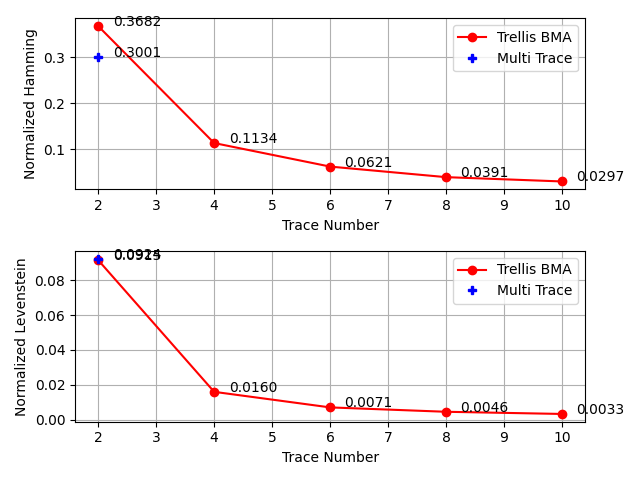

### DNA Trace Trellis Reconstruction

This is an implementation of a DNA trace reconstruction algorithm by using trellis and trellis BMA, an algorithm described in the
paper[1] by Srinivasavaradhan, Gopi, Pfister and Yekhanin.

##### Problem Background

The problem of trace reconstruction is to reconstruct a string _s_ given _k_ independent traces of it. 
A trace is a string generated from _s_, after passing through a deletion, insertion and substitution channels, each acts on every bit/character with some probability.
In DNA trace reconstruction, the source string is a sequence DNA nucleotides (ATGC) of some length, and _k_ independent noisy traces of it,
generated by a noisy synthesis and sequencing of it.
Nucleotides can be deleted, substituted, inserted or correct, according to certain probablitites.
The goal is to accurately and efficiently reconstruct an approximation of the source string given some traces.

For example - the transmitted string is AGTCT, and 3 traces are received: AGTTT, AGTC, CGTCT. Each one of the traces went thrught a deletion/insertion/substitution channel,
and the algorithm's objective is to conclude that the original string was AGTCT.

The algorithms described in the paper[1] are based on finding hidden markov chains in the traces to estimate the most likely source string leading to the received traces. 
This is done by building a [trellis](https://en.wikipedia.org/wiki/Trellis_(graph)) graph of the input traces,
either by combining all input traces into one big graph or building separate trellises and synchronising between them by an algorithm 
similar to Bitwise Majority Alignment (BMA).

This implementation is a naive python implementation of the two algorithms described, with the simplification of only handling uncoded strings:
if an ECC is applied to the traces, the results could be improved by considering them in the probabilities in the hidden markov chain.

##### Dataset

The dataset used in this project was made available by the researchers that published the paper[1], 
and includes thousands of real world synthesized and sequenced DNA strings, with their traces grouped into the appropriate clusters.
This dataset can be found in "Centers.txt" (the source strings) and "Clusters.txt" (The grouped traces). 
The source strings and traces are in the same order in both files, and each cluster contains a variable number of traces.

##### Usage

This project is a command line tool that serves two purposes - 
1) Running the reconstruction algorithms on the dataset, or custom data, with specified configurations
2) Parsing the results files of _1_ and calculating some statistics about the results, such as hamming and edit distance, 
   error distribution, worst cases of errors etc.
* Note that the two options are mutually exclusive - you cannot run both at the same time.   

Usage as printed by running `--help`:
```
usage: main.py [-h] [-p | -r] [--algorithm {trellis-bma,multi-trace}]
               [--trace-num TRACE_NUM] [--from-idx FROM_IDX] [--to-idx TO_IDX]
               [--beta-b BETA_B] [--beta-i BETA_I] [--beta-e BETA_E]
               [--results-file RESULTS_FILE]
               [--input-results-file INPUT_RESULTS_FILE [INPUT_RESULTS_FILE ...]]
               [-wh WORST_N_HAMMING] [-wl WORST_N_LEVENSTEIN] [-eh]

Reconstruct DNA string from noisy traces using trellis.

optional arguments:
  -h, --help            show this help message and exit
  -p, --parse           parse the input file instead of performing
                        reconstruction
  -r, --reconstruct     reconstruct DNA string from traces
  --algorithm {trellis-bma,multi-trace}
                        Algorithm to be used for trace reconstruction
  --trace-num TRACE_NUM
                        Number of traces to use for each cluster. if a cluster
                        has less than this number, it will be ignored
  --from-idx FROM_IDX   index of clusters in dataset to start from
  --to-idx TO_IDX       index of clusters in dataset to finish (non inclusive)
  --beta-b BETA_B       weight for backward values in trellis BMA
  --beta-i BETA_I       weight for the current trace in trellis BMA
  --beta-e BETA_E       weight for the other traces in trellis BMA
  --results-file RESULTS_FILE
                        write the reconstruction results to this file
  --input-results-file INPUT_RESULTS_FILE [INPUT_RESULTS_FILE ...]
                        when --parse is used, parse this results file/s.
  -wh WORST_N_HAMMING, --worst-n-hamming WORST_N_HAMMING
                        output the worst N reconstructions by hamming distance
  -wl WORST_N_LEVENSTEIN, --worst-n-levenstein WORST_N_LEVENSTEIN
                        output the worst N reconstructions by levenstein
                        distance
  -eh, --error-histogram
                        plot hamming and levenstein error histograms
```


##### Algorithms Used
(For more elaborate explanations, see [1])
###### Multi-trace Trellis
This algorithm creates a single trellis from all the traces. The trellis is essentially a DAG that models
the different events that could lead to the received set of traces, i.e the possible deletion, insertion and substitution events.
Each edge has a weight that is the probability this event had occurred (for example, that the first symbol in the first trace was substitued from A to T).

Each directed path from the first vertex to a "receiving" vertex represents a possible series of events with a certain joint distribution.
The algorithm builds the trellis and then uses BCJR inference to compute the most likely source symbol at each stage.

Since this algorithm combines all the traces to a single graph, by its design it's exponential in the number of traces (bad), 
but is more accurate as it represents the "real" probabilities and paths that each transmission went through. 

###### Trellis BMA
This algorithm is based on the multi-trace trellis, but is aimed to improve its exponential time complexity. 
Instead of building a single trellis graph from all the traces, It builds a separate graph for each trace, 
and syncs the probabilities of paths from different graphs. The algorithm approximates the probabilities at each stage 
by weighting the prior and posterior probabilities for each path in each trellis. The formula and possible weights can be found in the paper.

The main advantage of this algorithm is its running complexity which is linear in the number of traces and length of the string.

##### Results

These results were obtained by running the trellis BMA algorithm with fixed weights - β<sub>b</sub>=0.1, β<sub>i</sub>=0, β<sub>e</sub>=1
(See differences section for more details) on different number of traces.
Each source string is 110 characters long.

The source results file are in the results/* directory, and each trace number was run on a different number of samples because of computational limitations.

**Normalized hamming distance comparison** 

Our results:



Paper's[1] results:


The other statistics can be obtained by running:
```
python3 main.py -p --error-histogram --worst-n-hamming 10 --worst-n-levenstein 10 --input-results-file results/results*.txt
```
They include hamming and levenstein distance histogram, worst cases by hamming and levenstein distance, and average stats as opposed to normalized (by length).

###### Differences from original paper
* It was unclear how the data was analyzed. Most of the clusters contain many traces, so we drew at random _n_ traces from each cluster.
* No consideration for ECC (error correcting code) in trellis generation
* No consideration for blocking drift of output pointer from input pointer (to improve complexity) in trellis generation  
* No usage of β<sub>0</sub> parameter in trellis BMA
* Used fixed weight parameters and not the "optimized" hyperparameters for each number of traces
* It was unclear how to estimate the second half of the string, we didn't understand their approach. 
  Therefore, we estimated the first half, reversed the traces, built the trellises from scratch and estimated the second one the same way.
  
  The problem is that it is slow about twice as much, because the trellis generation (which is the bottleneck) is done twice.
* It was unclear how forward values (F<sup>k</sup>(v)) propagation worked in trellis BMA. I propagated it in the same way as the multi-trace trellis algorithm.


[1] S. R. Srinivasavaradhan, S. Gopi, H. D. Pfister and S. Yekhanin, "Trellis BMA: Coded Trace Reconstruction on IDS Channels for DNA Storage," 2021 IEEE International Symposium on Information Theory (ISIT), 2021, pp. 2453-2458, doi: 10.1109/ISIT45174.2021.9517821.

https://arxiv.org/abs/2107.06440